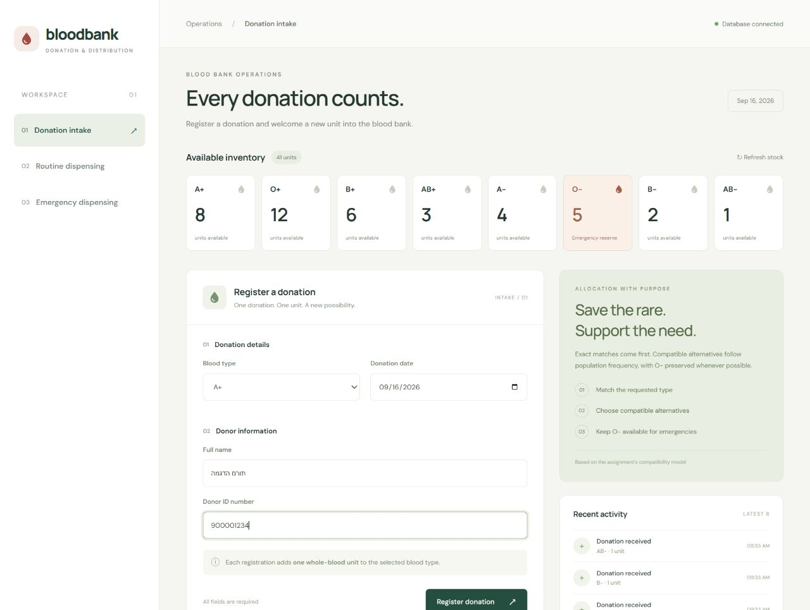
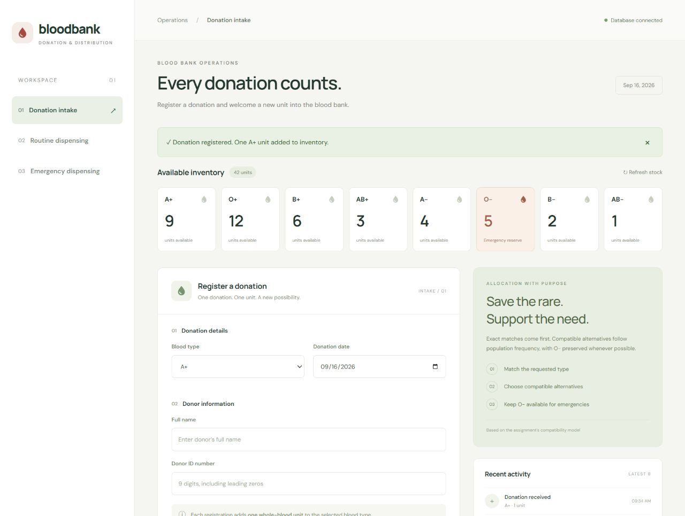
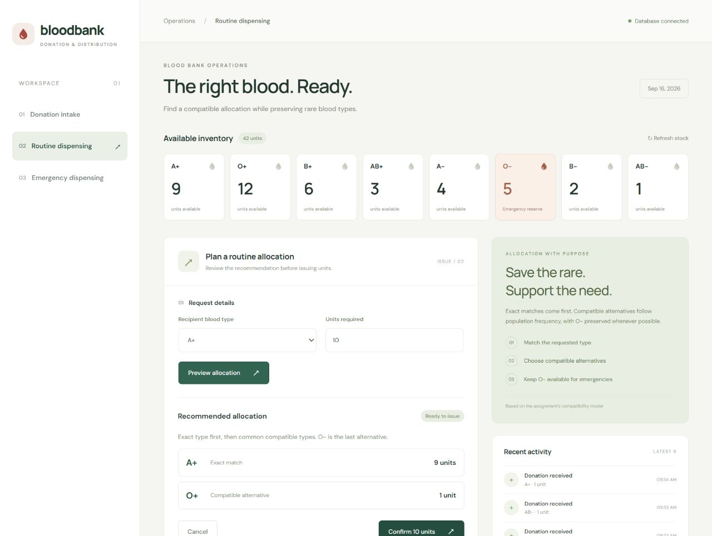
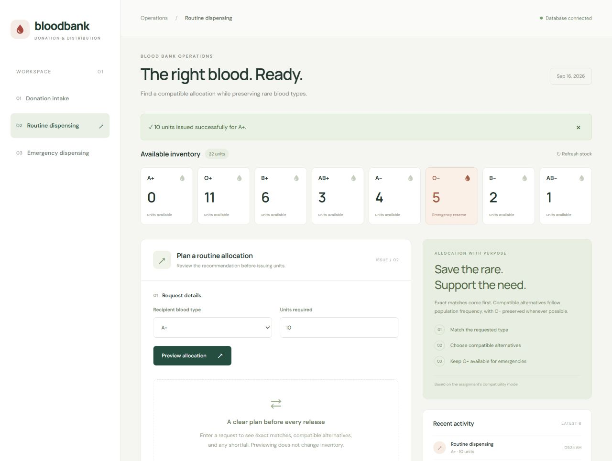
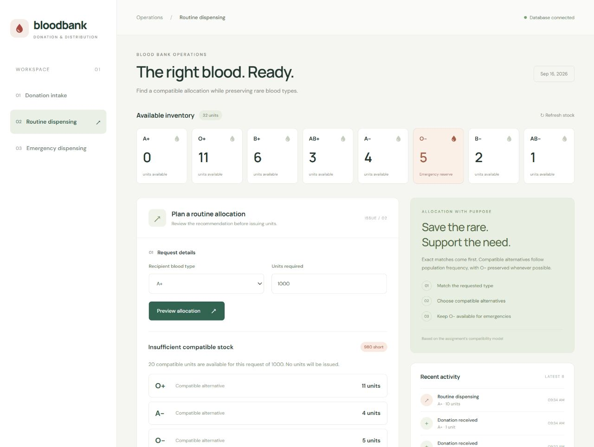
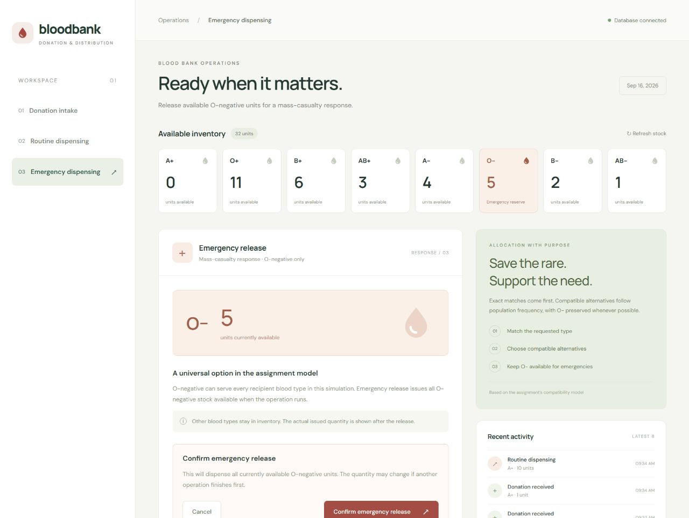
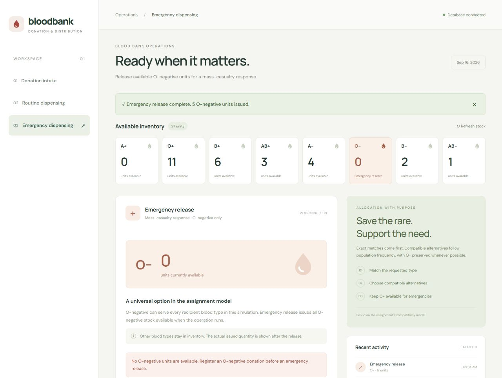
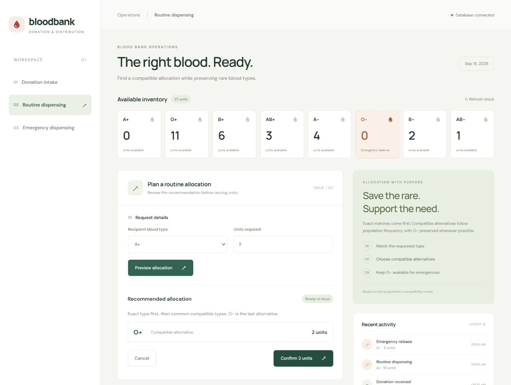

# מערכת BECS לניהול בנק דם

## הסבר הפתרון ותיעוד תרחישי שימוש

## מטרת המערכת והיקף הפתרון

המערכת מנהלת קליטה של תרומות דם וניפוק מנות בשגרה ובאירוע רב נפגעים. שלושת הממשקים מציגים מלאי משותף המתעדכן לאחר כל פעולה שהושלמה בהצלחה. מטרת התכנון היא לעמוד בכללי התאימות שבמטלה, להביא בחשבון את נדירות סוגי הדם ולשמור ככל האפשר מנות O- למצב חירום.

המימוש נכתב ב-TypeScript. ממשק המשתמש נבנה ב-React וב-Vite, השרת ב-Node.js וב-Express, והנתונים נשמרים ב-PostgreSQL. המערכת פועלת בדפדפן על Windows; הוראות ההתקנה וההרצה נמצאות בקובץ README של הפרויקט.

בהתאם להנחות המטלה, המערכת עוסקת בשמונת סוגי הדם המופיעים בטבלה שסופקה, בדם מלא בלבד וללא הגבלת משך אחסון. אין ניהול רכיבי דם או תאריכי תפוגה. כללי ההתאמה כאן הם מודל הלימוד שסופק במטלה, ולא פרוטוקול רפואי לשימוש קליני.

## סביבת ההדגמה

הצילומים נלקחו מהיישום הפועל ב-16 בספטמבר 2026, מול מסד נתונים נפרד בשם bloodbank_submission. השם ״תורם הדגמה״ והמספר 900001234 הם פרטי בדיקה מלאכותיים. מלאי העבודה הרגיל של הפרויקט לא שונה במסגרת הכנת צילומים אלה.

התרחיש מתחיל ב-41 מנות: A+ עם 8 מנות, O+ עם 12, B+ עם 6, AB+ עם 3, A- עם 4, O- עם 5, B- עם 2 ו-AB- עם מנה אחת. כל הצילומים מתעדים את המשך אותו תרחיש, ולכן ניתן לעקוב אחר שינויי הכמויות ביניהם.

## צילום 01 — קליטת תרומת דם

במסך הקליטה מוזנים ארבעת השדות שנדרשו במטלה: סוג הדם, תאריך התרומה, מספר הזיהוי והשם המלא של התורם. בדוגמה נבחר A+ והוזנו פרטי תורם מלאכותיים. לפני השמירה המלאי הוא 41 מנות, מהן 8 מסוג A+.

כל שליחה מוסיפה מנה אחת. השרת בודק את סוג הדם, את תקינות התאריך, שהתרומה אינה מתוארכת לעתיד, שם שאינו ריק ומספר זיהוי בן תשע ספרות. מספר הזיהוי נשמר כטקסט כדי לשמר אפסים בתחילתו; בדיקת ספרת ביקורת אינה ממומשת.

## צילום 02 — אישור קליטה ועדכון המלאי

לאחר רישום התרומה מוצגת הודעת הצלחה. מלאי A+ עולה מ-8 ל-9, וסך המנות עולה מ-41 ל-42. גם רשימת הפעולות האחרונות מציגה את התרומה החדשה.

פרטי התורם והתאריך נשמרים עם המנה במסד הנתונים. שינוי המלאי אינו רק שינוי חזותי במסך: המנה נשמרת וניתן להביא אותה בחשבון בבקשות ניפוק בהמשך.

## צילום 03 — המלצה לניפוק בשגרה

נדרשות 10 מנות עבור מקבל מסוג A+, אך קיימות רק 9 מנות A+. ההמלצה היא להשתמש תחילה ב-9 המנות מהסוג המדויק ולהשלים במנת O+ אחת, המתאימה לפי הטבלה שבמטלה.

O+ נבחר לפני A- משום ששכיחותו בטבלה היא 32% לעומת 4%. O- נשמר בעדיפות לשעת חירום. זהו שלב תצוגה מקדימה בלבד: סך המלאי עדיין 42 מנות, ולמשתמש מוצעות פעולות אישור או ביטול.

## צילום 04 — ביצוע הניפוק בשגרה

לאחר אישור הבקשה מוצגת הודעה על ניפוק 10 מנות. מלאי A+ יורד מ-9 לאפס, מלאי O+ יורד מ-12 ל-11, וסך המלאי יורד מ-42 ל-32. מלאי O- נשאר 5.

בשרת מתבצעת בדיקה חוזרת של ההמלצה מול המלאי העדכני. רישום הניפוק ושינוי מצבן של המנות מתבצעים באותה עסקת מסד נתונים, כך שכשל באמצע הפעולה אינו משאיר ניפוק חלקי.

## צילום 05 — טיפול במחסור במלאי מתאים

בדוגמה נדרשות 1,000 מנות למקבל A+. נותרו רק 20 מנות מתאימות: 11 מסוג O+, ארבע מסוג A- וחמש מסוג O-. לכן מוצג חוסר של 980 מנות.

סך המלאי הכללי הוא 32, אך סוגים שאינם מתאימים למקבל אינם נספרים כזמינים לבקשה זו. המערכת אינה מציעה אישור ניפוק כאשר אין די מנות מתאימות. המלאי נשאר 32; מדובר במדיניות שנבחרה למימוש: מילוי מלא של הבקשה או אי-ניפוק.

## צילום 06 — ניפוק בחירום

במסך החירום מוצגות חמש מנות O- זמינות. המשתמש בוחר לשחרר את כל המנות ומקבל שלב אישור לפני הביצוע.

פעולת החירום אינה מקבלת סוג דם אחר או כמות חלקית. בעת הביצוע השרת בודק מחדש כמה מנות O- זמינות ומנפק את כולן. מנות מסוגים אחרים נשארות במלאי.

## צילום 07 — סיום ניפוק החירום ומלאי ריק

מוצגת הודעת הצלחה על ניפוק חמש מנות O-. המלאי של O- הוא כעת אפס וסך המנות ירד מ-32 ל-27. שאר סוגי הדם לא השתנו.

המסך מציג הודעה שאין מנות O- זמינות וכפתור הניפוק אינו פעיל. גם פנייה ישירה לשרת כאשר המלאי ריק מחזירה שגיאה ואינה יוצרת רישום ניפוק חדש.

## צילום 08 — חלופה כאשר הסוג המבוקש אזל לחלוטין

בשלב האחרון נדרשות שתי מנות למקבל A+, כאשר מלאי A+ הוא אפס. המערכת ממליצה על שתי מנות O+ מתוך 11 המנות הזמינות מסוג זה.

הצילום מדגים במפורש את הדרישה להציע סוג חלופי זמין כשהסוג המבוקש נגמר. ההמלצה לא אושרה במסגרת צילום זה, ולכן סך המלאי נשאר 27 מנות.

## מעקב אחר המלאי בתרחיש

| שלב | A+ | O+ | O- | סך המנות |
| --- | --- | --- | --- | --- |
| מצב התחלתי | 8 | 12 | 5 | 41 |
| לאחר קליטת תרומה | 9 | 12 | 5 | 42 |
| לאחר ניפוק 10 מנות בשגרה | 0 | 11 | 5 | 32 |
| לאחר בקשה עם חוסר | 0 | 11 | 5 | 32 |
| לאחר ניפוק 5 מנות בחירום | 0 | 11 | 0 | 27 |
| לאחר הצגת חלופה בלבד | 0 | 11 | 0 | 27 |

## השלמות לפני הגשה לקורס

נותר לבדוק את הפתרון מול קובץ שקפי הקורס המעודכן, שטרם סופק, ולהשלים פרטי מגישים ומספרי סטודנט. התיעוד מתייחס למסמך מטלת BECS שנמסר; אין בו אישור לעמידה בדרישות נוספות שבשקפי הקורס.

## אסטרטגיית ההתאמה והנדירות

הבדיקה הראשונה היא תאימות: רק סוגי תורם המותרים למקבל לפי טבלת המטלה יכולים להיכלל בהמלצה. תחילה נבחרות מנות מהסוג המדויק המבוקש. אם הן אינן מספיקות, נבחנות החלופות המתאימות לפי שכיחותן באוכלוסייה, מהנפוצה לנדירה, כאשר O- הוא החלופה האחרונה.

הנתונים שנלקחו מהמטלה הם A+ בשיעור 34%, O+ בשיעור 32%, B+ בשיעור 17%, AB+ בשיעור 7%, A- בשיעור 4%, O- בשיעור 3%, B- בשיעור 2% ו-AB- בשיעור 1%. אלה ערכי המטלה, ולא טענה לנתוני אוכלוסייה עדכניים.

הבחירה לשמור O- לסוף רשימת החלופות נובעת מתפקידו בחירום. בתוך כל סוג דם נבחרות התרומות הישנות קודם. זהו כלל סדר עקבי, אף שאין במטלה הגבלת זמן אחסון.

אם המלאי מהסוג המדויק אינו מספיק, ניתן לשלב כמה סוגים מתאימים באותה בקשה. כשסך המנות המתאימות אינו מספיק לבקשה כולה, לא מתבצע ניפוק. אלה החלטות תכנון מפורשות; המטלה אינה מכתיבה נוסחה יחידה לדירוג חלופות או מדיניות למילוי חלקי.

## תשובות לשאלות החשיבה על מצב חירום

למה O-? לפי טבלת ההתאמה במטלה, O- הוא סוג התורם היחיד שמותר לכל שמונת סוגי המקבלים. לכן, במודל המטלה, כאשר סוג הדם של המקבל אינו ידוע בזמן אירוע רב נפגעים, זהו הסוג שנבחר לניפוק החירום.

מה המשמעות לניפוק בשגרה? שימוש שגרתי ב-O- מקטין את המלאי הזמין לחירום. לכן המערכת מעדיפה את הסוג המבוקש ואת החלופות המתאימות האחרות לפני שימוש ב-O-. אין חסימה מוחלטת של O- בשגרה: הוא עדיין משמש למקבלי O- או כשאין חלופה מתאימה אחרת.

## מבנה התוכנה ושמירת עקביות הנתונים

ממשק React מציג טפסים, מלאי ותוצאות. שרת Express מקבל בקשות HTTP, מאמת את הנתונים ומפעיל את כללי ההקצאה. PostgreSQL שומר את המנות, אירועי הניפוק והקישור בין כל מנה לאירוע שבו נופקה.

לכל מנה מזהה ייחודי, סוג דם, תאריך תרומה, פרטי תורם ומצב: זמינה או מנופקת. המלאי מחושב מתוך המנות הזמינות, ולא מתוך מונה נפרד שעלול לצאת מסנכרון.

פעולות שמשנות מלאי משתמשות בעסקה ובנעילה משותפת במסד הנתונים. כך בקשות מקבילות אינן יכולות לנפק אותה מנה פעמיים. מפתח בקשה ייחודי מאפשר לחזור על אותה בקשה אחרי ניתוק בלי לבצע שוב פעולה שכבר הושלמה.

## בדיקות ואימות

בבדיקת הפרויקט עברו 74 בדיקות לוגיקה ו-16 בדיקות אינטגרציה מול PostgreSQL. בדיקות הלוגיקה כוללות את כל 64 הצירופים של סוג תורם וסוג מקבל, סדרי עדיפות, שמירת O- ומקרי חוסר.

בדיקות האינטגרציה מכסות שמירת תרומות, אימות קלט, ניפוק לפי סדר תרומות, מחסור, המלצה שהתיישנה, ניפוק חירום, בקשות מקבילות, מניעת פעולה כפולה וביטול עסקה שנכשלה. בדיקת TypeScript ובניית גרסת הייצור עברו אף הן. צילומי המסך משלימים את הבדיקות האוטומטיות בתיעוד פעולות בממשק.

להרצה חוזרת: npm test לבדיקות הלוגיקה; npm run test:integration לבדיקות מסד הנתונים; npm run build לבדיקת הטיפוסים ולבנייה. בדיקות האינטגרציה דורשות מסד בדיקות נפרד, כמפורט ב-README.
